# Kashi E Money

Kashi E Money adalah aplikasi dompet digital berbasis Flutter untuk transaksi pembayaran, top up, transfer, QR payment, dan pembayaran App-to-App dari aplikasi merchant FindYourFit.

## Repository Terkait

- Aplikasi merchant: [WhoIsR/FashionApp_FindYourFit](https://github.com/WhoIsR/FashionApp_FindYourFit.git)
- Backend Kashi E Money: [WhoIsR/EMoney-Backend](https://github.com/WhoIsR/EMoney-Backend.git)

## Backend API

Kashi E Money memakai backend berikut:

```text
http://167.172.71.213:8083
```

Konfigurasi backend ada di:

```text
lib/core/constants/app_constants.dart
```

## Fitur Aplikasi

- Splash screen dan landing page Kashi E Money.
- Registrasi akun.
- Login email/password.
- Login menggunakan akun Google.
- Verifikasi email.
- Setup verifikasi 2 langkah atau 2FA.
- Metode 2FA menggunakan TOTP, notifikasi, dan email OTP.
- Penyimpanan token login menggunakan secure storage.
- Dashboard saldo.
- Tombol cepat untuk top up, transfer, bayar, dan tarik.
- QR payment.
- Riwayat transaksi.
- Promo.
- Halaman akun.
- Pembayaran dari merchant melalui deep link `kashi://pay`.
- Konfirmasi detail pembayaran merchant.
- Verifikasi transaksi memakai PIN.
- Verifikasi lanjutan memakai 2FA.
- Callback transaksi ke aplikasi merchant.
- Firebase Cloud Messaging untuk notifikasi transaksi.

## Alur Pembayaran dari FindYourFit

```text
FindYourFit membuka kashi://pay
        |
        v
Kashi menampilkan detail merchant dan total pembayaran
        |
        v
Pengguna menekan tombol bayar
        |
        v
Pengguna memasukkan PIN
        |
        v
Pengguna memasukkan kode 2FA
        |
        v
Backend Kashi memproses transaksi
        |
        v
Kashi mengirim callback ke FindYourFit
```

## Metode 2FA

Kashi menyediakan beberapa metode verifikasi:

- **TOTP**: kode diambil dari aplikasi authenticator.
- **Email OTP**: kode dikirim ke email pengguna.
- **Notifikasi**: kode atau approval dikirim melalui Firebase notification.

Pada alur pembayaran, 2FA berjalan setelah pengguna memasukkan PIN transaksi.

## Struktur Project

```text
lib/
|-- core/
|-- data/
|-- domain/
|-- injection/
`-- presentation/
```

Project menggunakan Clean Architecture, BLoC, GetIt, GoRouter, Dio, Firebase, App Links, dan URL Launcher.

## Menjalankan Project

```bash
flutter pub get
flutter run
```

Perintah `flutter pub get` digunakan untuk mengambil dependency Flutter. Perintah `flutter run` digunakan untuk menjalankan aplikasi ke emulator atau perangkat Android.

## Build APK

```bash
flutter build apk --debug
```

Hasil APK debug berada di:

```text
build/app/outputs/flutter-apk/app-debug.apk
```

## Pengujian

```bash
flutter analyze
flutter test
```

Perintah `flutter analyze` digunakan untuk mengecek kualitas kode Dart. Perintah `flutter test` digunakan untuk menjalankan unit test yang tersedia.

## Screenshot Aplikasi

<table>
  <tr>
    <td align="center"><strong>Landing Page</strong></td>
    <td align="center"><strong>Login</strong></td>
    <td align="center"><strong>Register</strong></td>
  </tr>
  <tr>
    <td>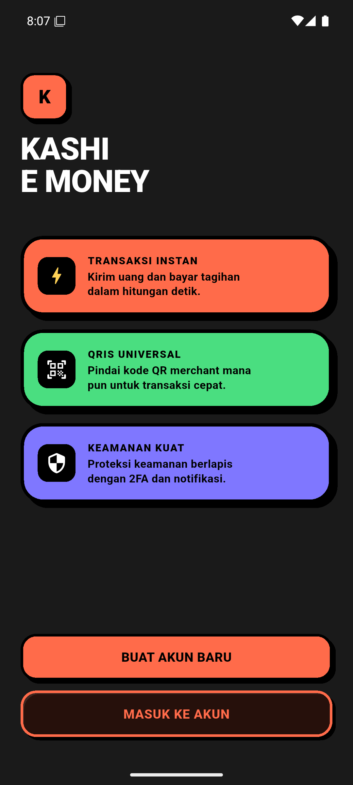</td>
    <td>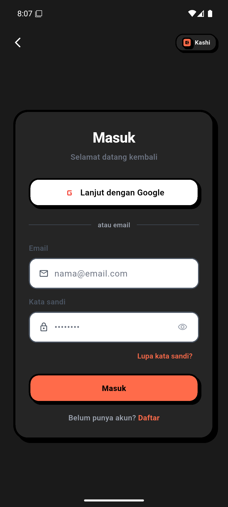</td>
    <td>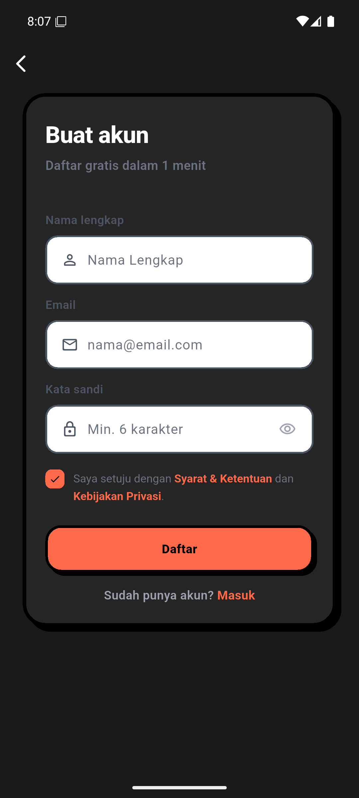</td>
  </tr>
  <tr>
    <td align="center"><strong>Dashboard</strong></td>
    <td align="center"><strong>Riwayat</strong></td>
    <td align="center"><strong>Promo</strong></td>
  </tr>
  <tr>
    <td>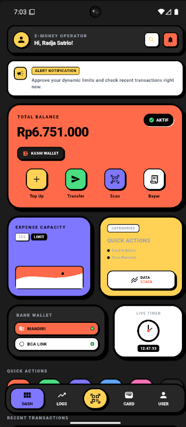</td>
    <td>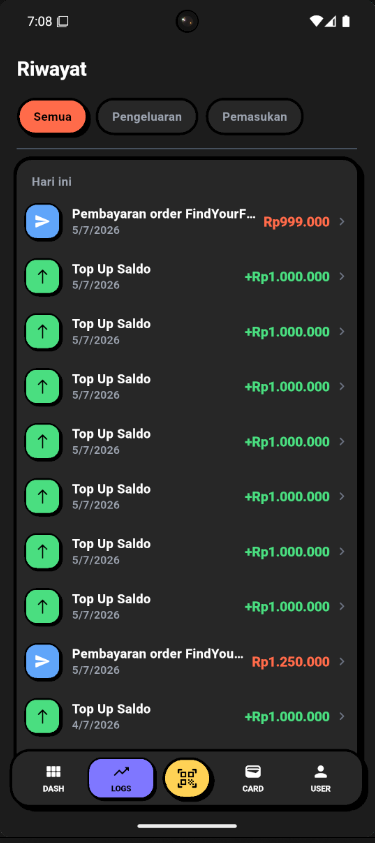</td>
    <td>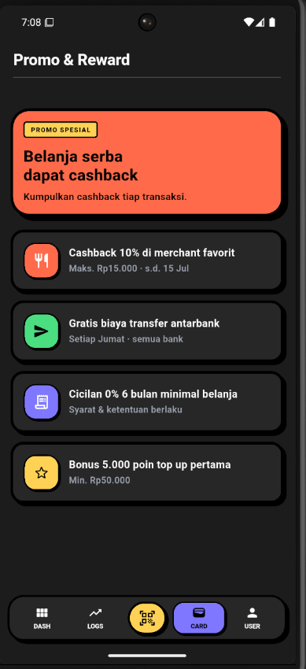</td>
  </tr>
  <tr>
    <td align="center"><strong>Akun</strong></td>
    <td align="center"><strong>Top Up</strong></td>
    <td align="center"><strong>Transfer Bank</strong></td>
  </tr>
  <tr>
    <td>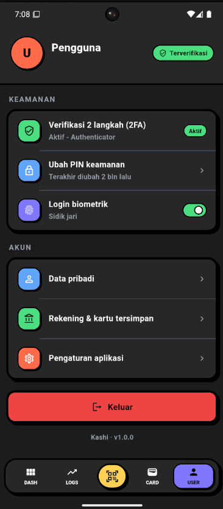</td>
    <td>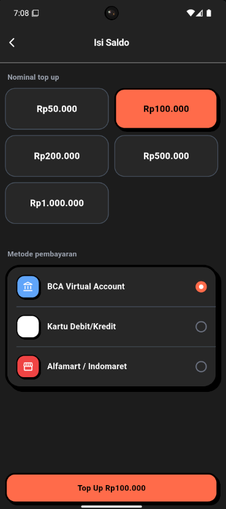</td>
    <td>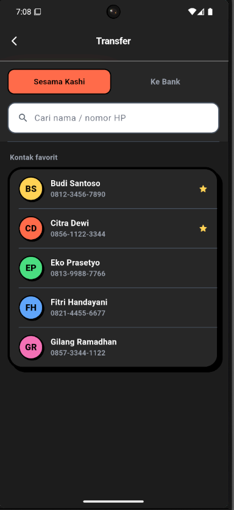</td>
  </tr>
  <tr>
    <td align="center"><strong>Transfer E-Wallet</strong></td>
    <td align="center"><strong>Scan QR</strong></td>
    <td align="center"><strong>Izin Kamera</strong></td>
  </tr>
  <tr>
    <td>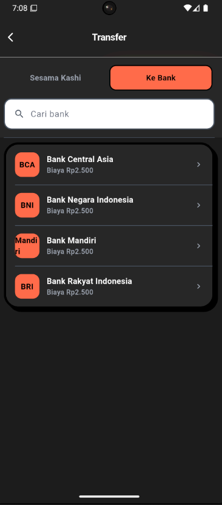</td>
    <td>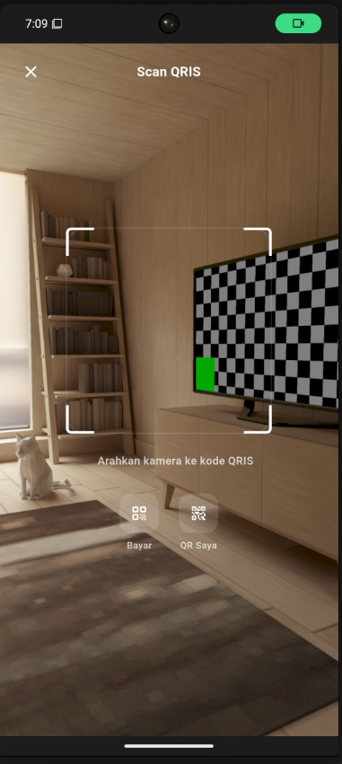</td>
    <td>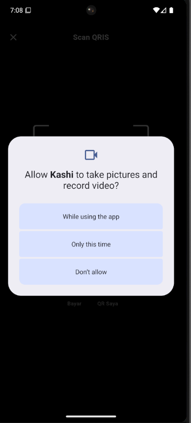</td>
  </tr>
  <tr>
    <td align="center"><strong>Payment Deep Link</strong></td>
    <td align="center"><strong>PIN Transaksi</strong></td>
    <td align="center"><strong>2FA TOTP</strong></td>
  </tr>
  <tr>
    <td>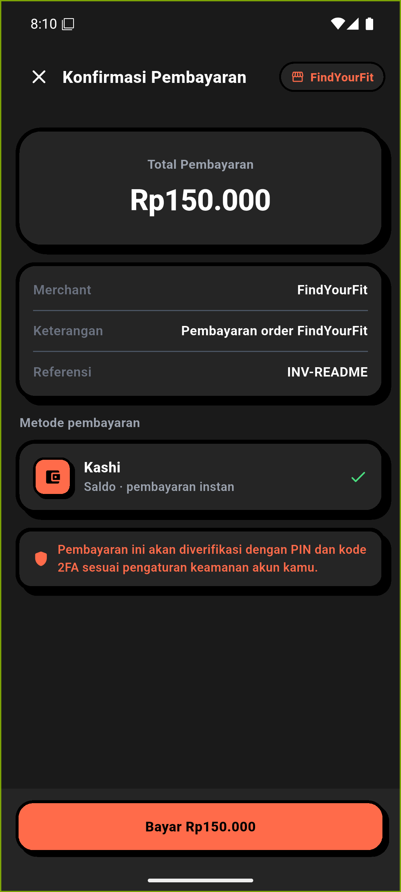</td>
    <td>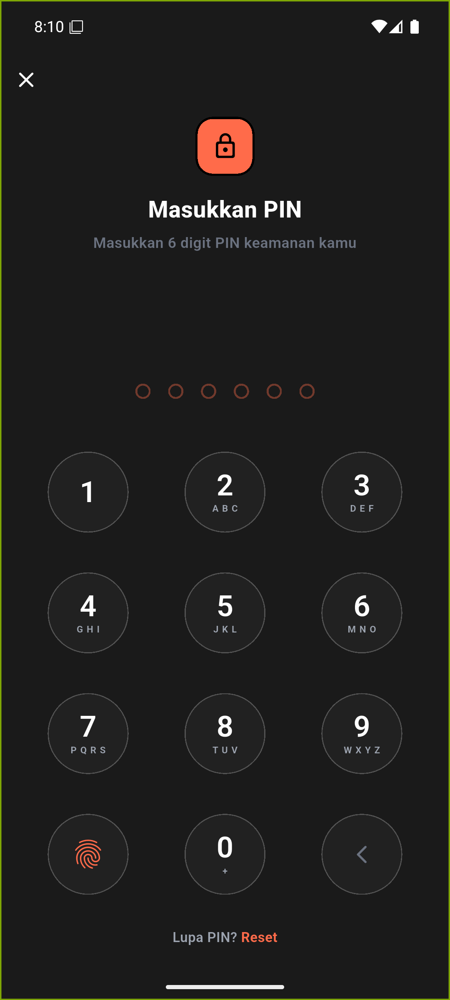</td>
    <td>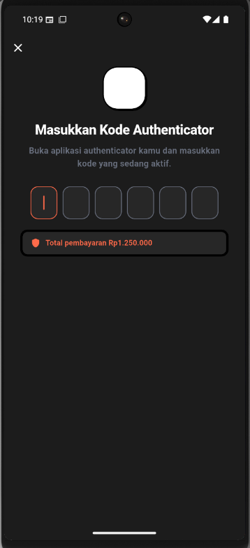</td>
  </tr>
  <tr>
    <td align="center"><strong>Payment Success</strong></td>
    <td align="center"><strong>Dashboard Lama</strong></td>
    <td align="center"><strong></strong></td>
  </tr>
  <tr>
    <td>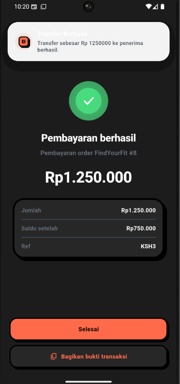</td>
    <td>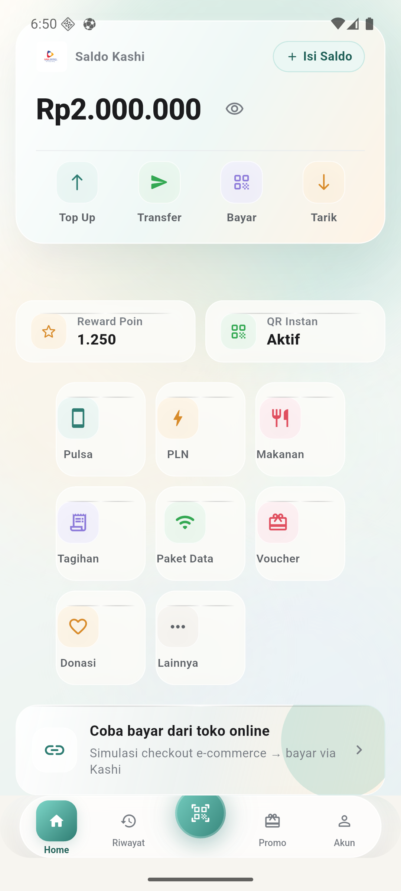</td>
    <td></td>
  </tr>
</table>

## Identitas

**Radja Satrio Seftiano**  
**NIM 1123150172**  
Teknik Informatika - Semester 6  
Institut Teknologi dan Bisnis Bina Sarana Global
